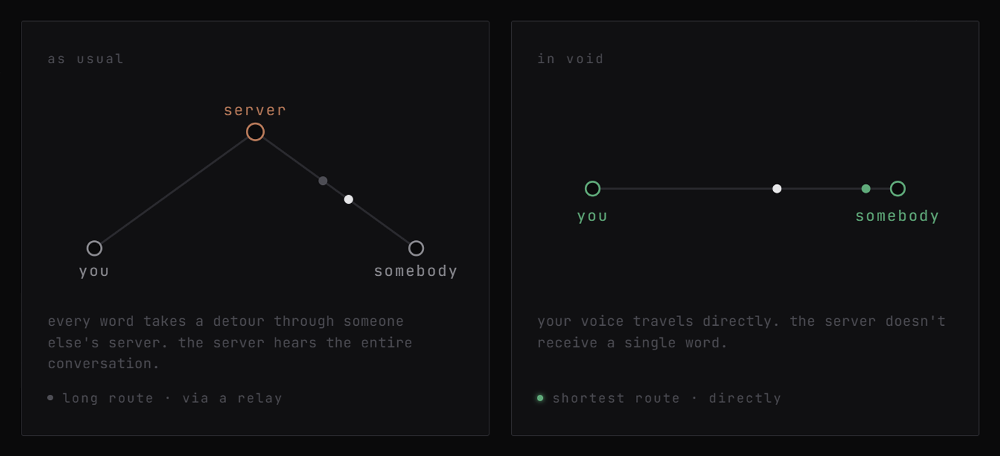
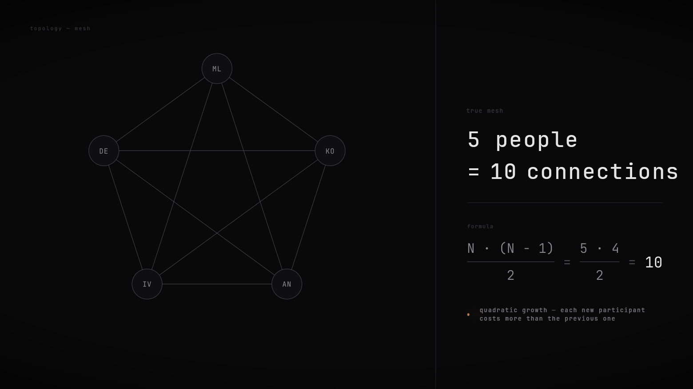
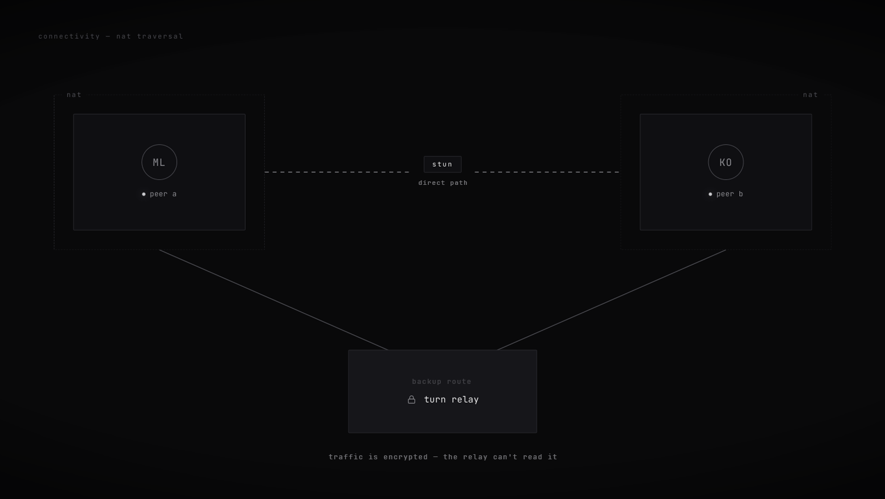

<div align="center">


**voice chat without the extras — no accounts, no history, just direct connections.**

<a href="README.md"></a>
<a href="docs/README.ru.md"></a>

<br>
<br>

<a href="https://void-room.space"></a>
<a href="https://app.void-room.space"></a>
<a href="https://github.com/jettsba/void/releases/latest/download/void_installer.exe"></a>

<a href="https://github.com/jettsba/void/releases/latest"></a>
<a href="https://github.com/jettsba/void/stargazers"></a>
<a href="LICENSE"></a>

</div>

---

> when i started building void, i had just one goal — to make calling fast and effortless.
> what i ended up with was a voice chat that physically can't be eavesdropped on
> from the outside — and i only realized that much later. privacy was never the goal.
> it's simply a side effect of stripping everything unnecessary out of the architecture.

<br>

create a room, share a short code, and start talking. when the last person leaves, the room **disappears**. nothing is stored because there's nowhere to store it.

voice, chat, file sharing, and screen sharing all happen **directly** between participants. the server only introduces devices to each other. once they're connected, it has nothing left to do.

<div align="center">
<br>
<a href="https://app.void-room.space"><b>→ try now, nothing to install</b></a>
<br>
<br>

</div>

---

## why it can't be wiretapped

there's **no database**. not "we have one, but we promise not to look" — there's simply no database at all. rooms exist only as a regular `Map` in the server's memory: a room code and a list of who's inside. when the last person leaves, everything is gone.

that's why there's nowhere to intercept a conversation from the server side — **it never exists there in the first place.** participants encrypt the media stream directly between their devices (DTLS-SRTP, with keys negotiated between browsers). even when a poor network forces traffic through a relay, it only forwards encrypted packets and has no way to decrypt them.

<sub>"impossible to eavesdrop on" refers to <i>the connection between participants</i>, not to their devices. if an endpoint is compromised, no p2p architecture can protect it — the audio can be captured before encryption ever happens. cryptography secures the channel, not a compromised endpoint.</sub>

---

## how it works

<div align="center">

**the server introduces two peers — then drops out of the call**



</div>

its entire job is signalling: it takes a connection description (SDP) from one side, hands it
to the other, and shuttles a handful of ICE candidates. a couple of kilobytes of setup text —
then it's out of the loop. **it never sees a byte of your audio, messages, or files.**

<table>
<tr>
<td width="50%" valign="top" align="center">

<br>
<b>true mesh · everyone to everyone</b>
<br>
<sub>the server never mixes audio, so participants connect directly to one another — <code>N·(N−1)/2</code> connections in total. that's also why rooms are limited to <b>10 people</b>. supporting more would require an SFU in the middle, which puts the media stream back on a server.</sub>
</td>
<td width="50%" valign="top" align="center">

<br>
<b>relay · only when a direct path fails</b>
<br>
<sub>in symmetric / CG‑NAT (mobile carriers) ~1 in 4 pairs can't connect directly and fall back to a
TURN relay (coturn). it ferries the <b>still‑encrypted</b> packets — it can't decrypt them either.</sub>
</td>
</tr>
</table>
</br>
the shortest path is also the lowest latency: it sounds like the other person is next door,
because the audio isn't looping through a datacenter in another country. And a VPN, if you
need one to reach the site, only carries the page load and signalling — the call itself goes
direct and never touches the tunnel.

---

## what's inside

|                       |                                                                                                                      |
| --------------------- | -------------------------------------------------------------------------------------------------------------------- |
| **voice**             | full‑mesh WebRTC, direct P2P audio between everyone in the room, no server in the path                               |
| **noise suppression** | RNNoise (ML model in WASM/AudioWorklet) strips fans, keyboards, background hum — client‑side, before it's even sent  |
| **chat & files**      | over the data channel: text, files up to 100 MB, images up to 10 MB                                                  |
| **screen sharing**    | with real system audio, up to 1080p60                                                                                |
| **resilient**         | perfect negotiation, automatic ICE‑restart, peer rebuild, a watchdog that catches "connected‑but‑dead" peers in ~5 s |
| **native desktop**    | frameless titlebar, system tray with live in‑room status, global hotkeys, signed auto‑updates, `void://` deep links  |
| **bilingual**         | English / Russian · **streamer mode** hides the room code so it never leaks on stream                                |

---

<details>
<summary><b>the stack</b></summary>

<br>

no React, no bundlers, no TypeScript toolchain. the entire frontend is
**vanilla JavaScript**, loaded with `<script defer>` and served as‑is. The whole thing is meant
to be **read** — a complete, production‑hardened WebRTC system you can actually follow end to end.

| layer           | tech                                                          |
| --------------- | ------------------------------------------------------------- |
| signalling      | Node.js 20 · Express · ws                                     |
| media transport | WebRTC (perfect negotiation, DTLS‑SRTP)                       |
| chat & files    | RTCDataChannel (binary chunked transfer)                      |
| audio DSP       | Web Audio — RNNoise → high/low‑pass → compressor → noise gate |
| frontend        | vanilla JS, no frameworks, no build step                      |
| desktop         | Tauri 2 (Rust + WebView2)                                     |
| relay           | coturn (TURN, HMAC short‑lived credentials)                   |
| reverse proxy   | Caddy (automatic HTTPS)                                       |
| deploy          | Docker + docker‑compose, CI on push                           |

</details>

---

## try it

<table>
<tr>
<td valign="top">

**web** — any modern browser, nothing to install

**→ [app.void-room.space](https://app.void-room.space)**

</td>
<td valign="top">

**windows desktop** — native: tray, global hotkeys, auto‑update

**→ [download the installer](https://github.com/jettsba/void/releases/latest/download/void_installer.exe)**

</td>
</tr>
</table>

---

## for developers

```bash
git clone https://github.com/jettsba/void.git
cd void
npm ci
npm start          # → http://localhost:3000
```

self‑hosting, environment variables, the TURN setup are all in **[docs/DEVELOPMENT.md](docs/DEVELOPMENT.md)**.

bugs and ideas → open an [issue](https://github.com/jettsba/void/issues) or reach out on
[Telegram](https://t.me/casheaterr).

---


<div align="center">
<sub><a href="../README.ru.md">switch to russian</a> ·<a href="https://t.me/casheaterr"> crafted by casheaterr</a></sub>
<br>
<sub><a href="../LICENSE"><b>AGPL‑3.0</b></a><b> © 2026 void</b></sub>
</div>
