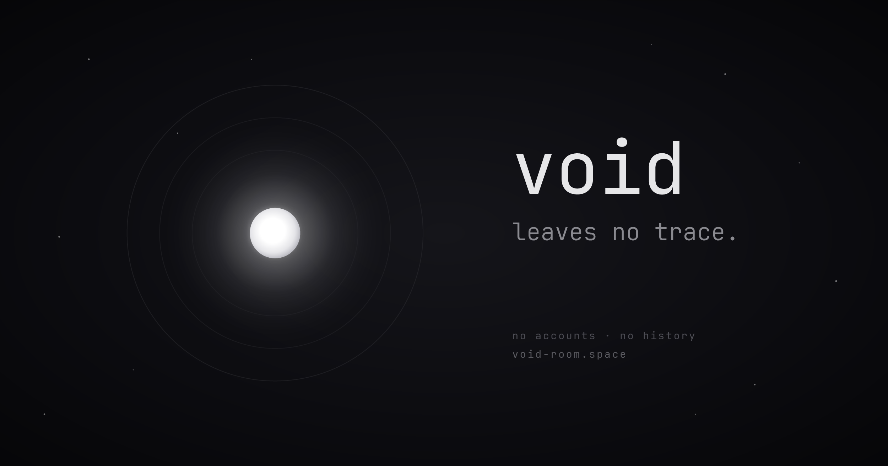
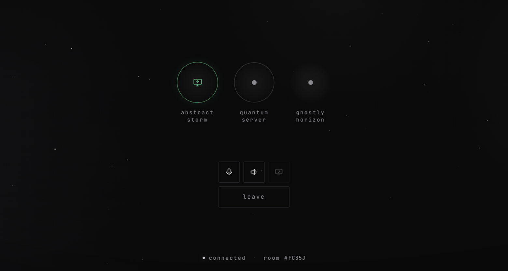
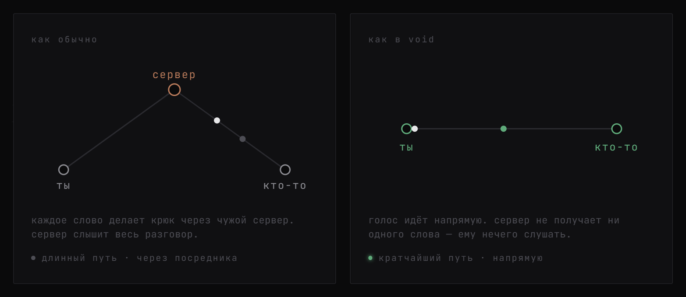
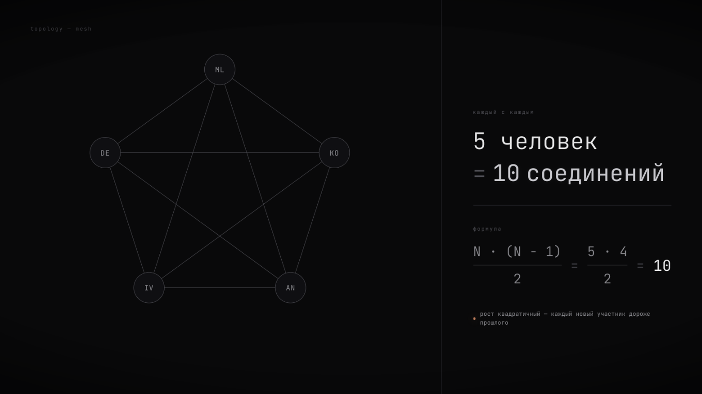
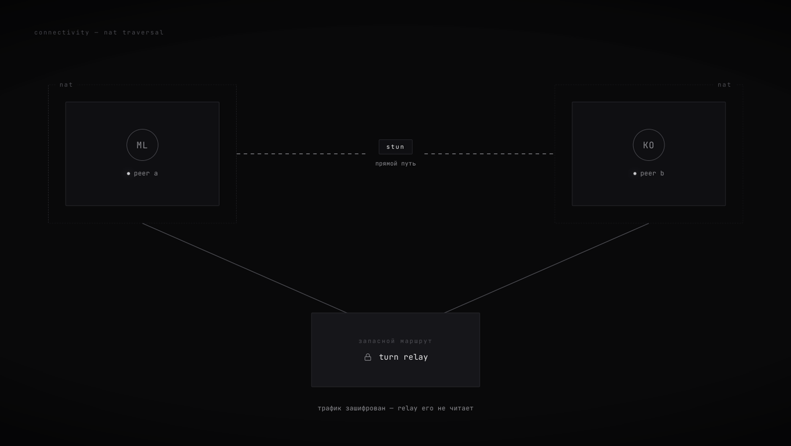
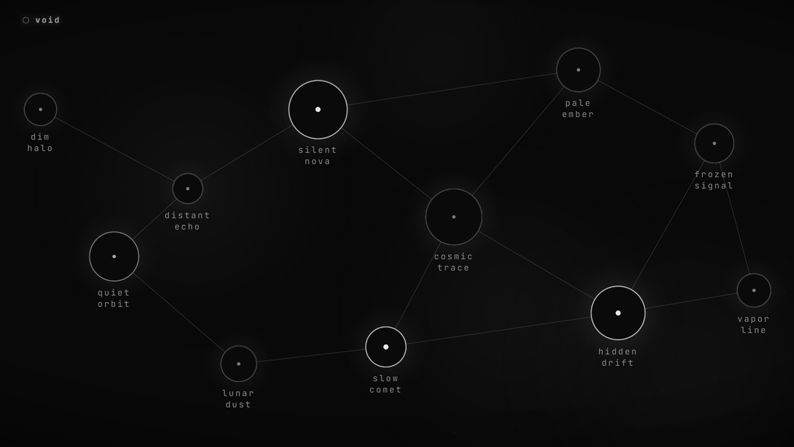

<div align="center">



**голосовая связь без лишнего — без аккаунтов, без истории, напрямую.**

<a href="../README.md"></a>
<a href="README.ru.md"></a>

<br>
<br>

<a href="https://void-room.space"></a>
<a href="https://app.void-room.space"></a>
<a href="https://github.com/jettsba/void/releases/latest/download/void_installer.exe"></a>

<a href="https://github.com/jettsba/void/releases/latest"></a>
<a href="https://github.com/jettsba/void/stargazers"></a>
<a href="../LICENSE"></a>

</div>

---

> создавая void, я преследовал лишь одну возможность — созвониться быстро и без препятствий.
> в результате получился голосовой чат, разговор в котором физически нельзя прослушать
> со стороны — и понял я это уже сильно позже. приватность не была целью. это побочка того, что из схемы выброшено все лишнее.

<br>

открой комнату, поделись коротким кодом, говори — и в момент, когда выходит последний, комната
**исчезает**. ничего не записано, потому что записывать было некуда.

голос, чат, файлы и демонстрация экрана — все **напрямую**. сервер нужен лишь чтобы устройства друг с другом; после — он больше не участвует.

<div align="center">
<br>
<a href="https://app.void-room.space"><b>→ попробовать в браузере</b></a>
<br>
<br>

</div>

---

## почему это невозможно прослушать

базы данных **нет**. не «есть, но мы туда правда не смотрим», а нет как явления. комнаты лежат в
обычном `Map` в памяти процесса: код комнаты и список тех, кто в ней сидит. вышел последний → не осталось ровным счетом ничего.

поэтому прослушать разговор со стороны попросту негде: **его нет на сервере.** собеседники шифруют
поток напрямую (DTLS‑SRTP, ключи согласуются между браузерами). даже когда кривая сеть гонит разговор
через relay — он пересылает уже зашифрованные пакеты и расшифровать их не может.

<sub>«невозможно прослушать» относится к <i>пути между собеседниками</i>, а не к их устройствам.
если эндпоинт заражен — никакой P2P не спасет: звук снимут там, где он звучит, еще до всякого шифрования.
криптография защищает канал, а не дырявый эндпоинт.</sub>

---

## как это устроено

<div align="center">

**сервер сводит двоих — и выпадает из звонка**



</div>

вся его работа — сигналинг: принять от одной стороны описание соединения (SDP), передать другой,
погонять между ними ICE‑кандидатов. Пара килобайт служебного текста — и он отпадает. **он не видит
ни байта голоса, сообщений или файлов.**

<table>
<tr>
<td width="50%" valign="top" align="center">

<br>
<b>настоящий mesh · каждый соединен с каждым</b>
<br>
<sub>сервер звук не микширует, поэтому участники соединяются друг с другом сами — <code>N·(N−1)/2</code>
связей. отсюда и лимит участников: <b>до 10 человек</b>. больше — только через SFU в середине, а он снова
начнет видеть поток.</sub>
</td>
<td width="50%" valign="top" align="center">

<br>
<b>relay · только когда прямой путь невозможен</b>
<br>
<sub>на симметричном / CG‑NAT (мобильные операторы) ~каждая четвертая пара не соединяется напрямую и
уходит на TURN‑релей (coturn). он перенаправляет <b>уже зашифрованные</b> пакеты — расшифровать их он не может.</sub>
</td>
</tr>
</table>
</br>
кратчайший путь — это и есть минимальная задержка: слышно так, будто собеседник в соседнем доме, потому
что голос не идет через дата‑центр в другой стране. А VPN, если он нужен, чтобы открыть сайт, несет
только загрузку страницы и сигналинг — сам разговор все еще идет напрямую.

---

## что внутри

|                         |                                                                                                    |
| ----------------------- | -------------------------------------------------------------------------------------------------- |
| **голос**               | полный mesh WebRTC, прямой P2P‑звук между всеми в комнате, сервера в пути нет                      |
| **шумоподавление**      | RNNoise (ML‑модель в WASM/AudioWorklet) режет кулер, клавиатуру, фон — на клиенте, еще до отправки |
| **чат и файлы**         | по data‑каналу: текст, файлы до 100 МБ, изображения до 10 МБ                                       |
| **демонстрация экрана** | до 1080p60, с системным звуком                                                                     |
| **стабильность**        | perfect negotiation, авто ICE‑restart, пересборка пира, watchdogs                                  |
| **нативный десктоп**    | трей с живым статусом комнаты, глобальные хоткеи, подписанные авто‑обновления, deep‑link `void://` |

---

<details>
<summary><b>стек</b></summary>

<br>

нет ни React, ни бандлеров, ни TypeScript‑тулчейна. весь фронтенд — **чистый
JavaScript**, чтобы его можно
было **прочитать**. полноценная WebRTC‑система, которую реально проследить от начала до конца.

| слой            | технологии                                                       |
| --------------- | ---------------------------------------------------------------- |
| сигналинг       | Node.js 20 · Express · ws                                        |
| транспорт медиа | WebRTC (perfect negotiation, DTLS‑SRTP)                          |
| чат и файлы     | RTCDataChannel (бинарный chunked‑transfer)                       |
| аудио‑DSP       | Web Audio — RNNoise → highpass/lowpass → компрессор → noise‑gate |
| фронтенд        | vanilla JS                                                       |
| десктоп         | Tauri 2 (Rust + WebView2)                                        |
| relay           | coturn (TURN, короткоживущие HMAC‑credentials)                   |
| reverse proxy   | Caddy (авто‑HTTPS)                                               |
| деплой          | Docker + docker‑compose, CI на push                              |

</details>

---

## попробовать

<table>
<tr>
<td valign="top">

**веб** — запустится в любом современном браузере

**→ [app.void-room.space](https://app.void-room.space)**

</td>
<td valign="top">

**desktop приложение** — нативно: трей, глобальные хоткеи, автообновления

**→ [скачать установщик](https://github.com/jettsba/void/releases/latest/download/void_installer.exe)**

</td>
</tr>
</table>

---

## разработчикам

```bash
git clone https://github.com/jettsba/void.git
cd void
npm ci
npm start          # → http://localhost:3000
```

self‑hosting, переменные окружения, настройка TURN —
все в **[DEVELOPMENT.md](DEVELOPMENT.md)**.

баги и идеи → заводи [issue](https://github.com/jettsba/void/issues) или пиши в
[Telegram](https://t.me/casheaterr).

---



<div align="center">
<sub><a href="../README.md">switch to english</a> ·<a href="https://t.me/casheaterr"> crafted by casheaterr</a></sub>
<br>
<sub><a href="../LICENSE"><b>AGPL‑3.0</b></a><b> © 2026 void</b></sub>
</div>
